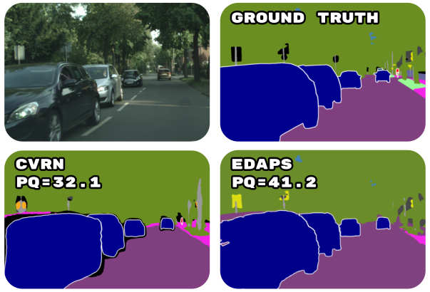
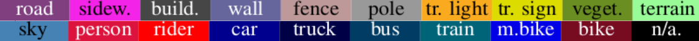
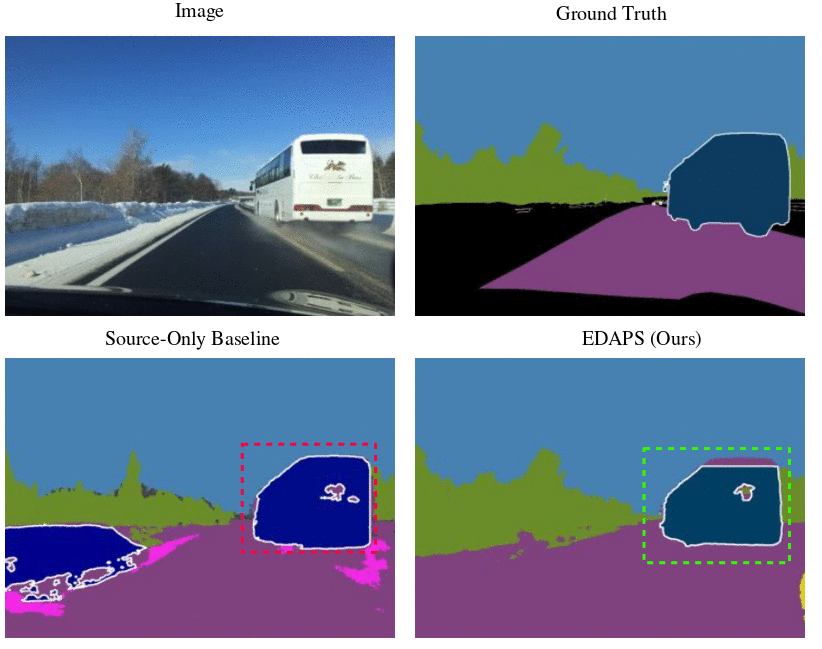

## EDAPS: Enhanced Domain-Adaptive Panoptic Segmentation

**by [Suman Saha](https://susaha.github.io/), [Lukas Hoyer](https://lhoyer.github.io/), 
[Anton Obukhov](https://www.obukhov.ai/), [Dengxin Dai](https://vas.mpi-inf.mpg.de/dengxin/), 
and [Luc Van Gool](https://scholar.google.de/citations?user=TwMib_QAAAAJ&hl=en)**

**[[Arxiv]](TODO)**



## Overview

With autonomous industries on the rise, domain adaptation of the visual perception stack is an important research direction due to the cost savings promise.
Much prior art was dedicated to domain-adaptive semantic segmentation in the synthetic-to-real context.
Despite being a crucial output of the perception stack, panoptic segmentation has been largely overlooked by the domain adaptation community.
Therefore, we revisit well-performing domain adaptation strategies from other fields, adapt them to panoptic segmentation, and show that they can effectively enhance panoptic domain adaptation.
Further, we study the panoptic network design and propose a novel architecture (**EDAPS**) 
designed explicitly for domain-adaptive panoptic segmentation. 
It uses a shared, domain-robust transformer encoder to facilitate the joint adaptation of semantic and instance features, 
but task-specific decoders tailored for the specific requirements of both domain-adaptive semantic and instance segmentation. 
As a result, the performance gap seen in challenging panoptic benchmarks is substantially narrowed. 
**EDAPS** significantly improves the state-of-the-art performance for panoptic segmentation UDA 
by a large margin of **25\%** on **SYNTHIA-to-Cityscapes** and even **72\%** on the more challenging **SYNTHIA-to-Mapillary Vistas**.


When comparing EDAPS to the previous state-of-the-art UDA method CVRN, we can see that EDAPS has several strengths, as demonstrated in the examples below. 

**Qualitative Results (SYNTHIA → Cityscapes)**




The major improvements come from better panoptic segmentation of the "thing" classes (e.g., "person", "rider", "car") and "stuff" classes (e.g., "traffic light", "traffic sign", "pole") across different object scales, appearance, and viewing angles. 
In general, EDAPS can better delineate object boundaries, resulting in better-quality pixel-level panoptic segmentation. 
Note that the detected object shapes predicted by the EDAPS have a better resemblance of real-world objects than the prior art. 
Thanks to the domain-robust Mix Transformer (MiT-B5) backbone, EDAPS can learn a richer set of domain-invariant semantic and instance features helpful in better segmentation of fine structures. 

EDAPS can better segment occluded instances in crowded scenes. 
Specifically, the "person" segments predicted by EDAPS preserve finer details of the human body even when instances are occluded. 
Similar observations can be made for the "rider" and "car" classes. 
For large object instances, such as "bus", EDAPS can segment out the entire object, whereas prior art fails to do so. 

**Qualitative Results (SYNTHIA → Mapillary Vistas)**




In this section, We show visual qualitative results on SYNTHIA → Mapillary Vistas UDA panoptic benchmark.  
EDAPS segments better the pole instance.
It can be observed that the baseline model struggles to learn the correct class labels and instance masks, 
whereas EDAPS successfully bridges the domain gap by learning the correct semantics and instances. 
EDAPS produces better panoptic segmentation for "bus", "rider", "motorbike", "car", "traffic sign".

To learn more about EDAPS, we invite you to refer to our 
[[Paper]](TODO).

If you find our project valuable for your research, we kindly request that you consider citing it.

```
@InProceedings{saha2023Edaps,
  title={EDAPS: Enhanced Domain-Adaptive Panoptic Segmentation },
  author={Saha, Suman and Hoyer, Lukas and Obukhov, Anton and Dai, Dengxin and Van Gool, Luc},
  booktitle={arXiv},
  year={2023}
}
```

## Comparison with State of the Art

It can be seen that EDAPS consistently outperforms previous methods with a large margin in all aggregated 
metrics (mSQ, mRQ, mPQ). Specifically, EDAPS improves the mPQ from 33.0 to 41.2 on SYNTHIA → Cityscapes and
from 21.3 to 36.6 SYNTHIA → Mapillary, which is a respective improvement of remarkable 25% and 72% over
previous works.

**Quantative Results (SYNTHIA → Cityscapes)**

|                  | mSQ      | mRQ      | mPQ      |
|------------------|----------|----------|----------|
| FDA [1]          | 65.0     | 35.5     | 26.6     |
| CRST [2]         | 60.3     | 35.6     | 27.1     |
| AdvEnt [3]       | 65.6     | 36.3     | 28.1     |
| CVRN [4]         | 66.6     | 40.9     | 32.1     |
| UniDAPS [5]      | 64.7     | 42.2     | 33.0     |
| **EDAPS (Ours)** | **72.7** | **53.6** | **41.2** |


**Quantative Results (SYNTHIA → Mapillary Vistas)**

|                  | mSQ      | mRQ      | mPQ      |
|------------------|----------|----------|----------|
| FDA [1]          | 63.8     | 26.1     | 19.1     |
| CRST [2]         | 63.9     | 25.2     | 18.8     |
| AdvEnt [3]       | 63.6     | 24.7     | 18.3     |
| CVRN [4]         | 65.3     | 28.1     | 21.3     |
| **EDAPS (Ours)** | **71.7** | **46.1** | **36.6** |


References:

1. Yanchao Yang and Stefano Soatto. Fda: Fourier domain adaptation for semantic segmentation. In Proceedings of the IEEE/CVF Conference on Computer Vision and Pattern Recognition, pages 4085–4095, 2020.
2. Yang Zou, Zhiding Yu, Xiaofeng Liu, BVK Kumar, and Jinsong Wang. Confidence regularized self-training. In Proceedings of the IEEE/CVF International Conference on Computer Vision, pages 5982–5991, 2019.
3. Tuan-Hung Vu, Himalaya Jain, Maxime Bucher, Matthieu Cord, and Patrick Pérez. Advent: Adversarial entropy minimization for domain adaptation in semantic segmentation. In Proceedings of the IEEE/CVF Conference on Computer Vision and Pattern Recognition, pages 2517–2526, 2019.
4. Jiaxing Huang, Dayan Guan, Aoran Xiao, and Shijian Lu. Cross-view regularization for domain adaptive panoptic segmentation. In Proceedings of the IEEE/CVF Conference on Computer Vision and Pattern Recognition, pages 10133–10144, 2021.
5. Jingyi Zhang, Jiaxing Huang, and Shijian Lu. Hierarchical mask calibration for unified domain adaptive panoptic segmentation. arXiv preprint arXiv:2206.15083, 2022.


## Code Base Features

This repository provides support for several functionalities, including:

* Dataloading of ground truth labels for both top-down (labels, boxes, and instance masks) and bottom-up (labels, centers, and offsets) panoptic segmentation.
* Generation of panoptic ground truth labels for the SYNTHIA and Mapillary Vistas datasets following Cityscapes 19 classes format. 
   This allows training and evaluating models on standard UDA benchmarks such as SYNTHIA → Cityscapes and SYNTHIA → Mapillary Vistas.
* Model evaluation using three different metrics: mIoU (for semantic segmentation), mAP (for instance segmentation), and mPQ (for panoptic segmentation).
* Evaluation of both top-down and bottom-up based panoptic segmentation models.
* Visualization of semantic, instance, and panoptic segmentations.


## Setup Environment
For this project, we used python 3.8.5. We recommend setting up a new virtual environment:
```shell
python -m venv ~/venv/edaps
```

In this environment, install the required libraries for EDAPS:

Install torch related stuff:
```shell
source ~/venv/edaps/bin/activate
pip install torch==1.7.1
pip install torchvision==0.8.2
```

Install [MMCV](https://github.com/open-mmlab/mmcv):
```shell
pip install -U openmim
mim install mmcv-full=1.6.1
```

Install [MMDetection](https://github.com/open-mmlab/mmdetection):
```shell
mkdir -p /path/to/your/codebase/folder
cd /path/to/your/codebase/folder
git clone https://github.com/open-mmlab/mmdetection.git
cd mmdetection
pip install -v -e .
```

We use MMDetection version 2.25.1 in this work.

Install the other dependecies:
```shell
pip install -r requirements.txt
```

## Download Pretrained Weights

### MiT-B5 Weights

Download the [MiT-B5 weight](https://drive.google.com/drive/folders/1b7bwrInTW4VLEm27YawHOAMSMikga2Ia?usp=sharing)

MiT-B5 pretrained on ImageNet-1K provided by the official [SegFormer repository](https://github.com/NVlabs/SegFormer) 

Put the pretrained weights in a folder `pretrained/` within this project.

For most of the experiments, only mit_b5.pth is necessary.

## Checkpoints

Below, we provide checkpoints for EDAPS for different UDA benchmarks.

* [EDAPS for Synthia→Cityscapes](https://drive.google.com/file/d/1Dqm58cW8l6cWl_uhJ-I0QRx3DaCjp_--/view?usp=sharing)
* [EDAPS for Synthia→Mapillary](https://drive.google.com/file/d/1rQYHKUt28HVg_9wXxqSTw59aSE_Cbpfj/view?usp=sharing)


Extract these checkpoint folders under `edaps_experiments/exp-{expId:05d}/checkpoints/`.
For example, for expId=7, the path would be: `edaps_experiments/exp-00007/checkpoints/edaps_synthia_to_cityscapes`.

The checkpoints come with the training logs. Please note that:

* The logs provide the mPQ and mIoU for 19 classes.
It is necessary to convert the mPQ and mIoU to the 16 valid classes. 
Please, refer to [this](https://github.com/susaha/edaps#testing--predictions) section  for converting the mPQ and mIoU.

## Setup Datasets

### Download Datasets

**Synthia:** Download SYNTHIA-RAND-CITYSCAPES from
[here](http://synthia-dataset.net/downloads/) and extract it to `data/synthia`.

**Cityscapes:** Download leftImg8bit_trainvaltest.zip and
gt_trainvaltest.zip from [here](https://www.cityscapes-dataset.com/downloads/)
and extract them to `data/cityscapes`.

**Mapillary Vistas:** Download Mapillary Vistas from
[here](https://www.mapillary.com/dataset/vistas) and extract it to `data/mapiilary`. 

### Generate Panoptic Ground Truth Labels

One can follow the steps below to generate the ground truth labels for
panoptic segmentation.
Alternatively, one can download the preprocessed ground truth lables from the below links:
[here](https://drive.google.com/drive/folders/1GuD_K7xoD27xHbKgoObYlT0LMdor55kW?usp=sharing)


**Synthia:**

The creators of the Synthia dataset do not offer panoptic ground truth (GT) labels. 
Instead, they provide separate semantic and instance labels, which are saved together in a single PNG file. 
The semantic labels are stored in the first channel of the image, while the instance labels are saved in the second channel. 
To generate color PNG panoptic GT labels from these files, follow these two steps:

***STEP 1:***

The following script generates the panoptic GT label files
by extracting the semantic and instance GT labels 
from the two channels of the ground truth PNG files provided with the Synthia dataset. 
It reads these labels, to create the panoptic GT label files, 
which are saved in the form of a pickle files.

Run the following command to generate and save the panoptic ground truth labels as pickle files:

```shell
./synthiascripts/gen_and_save_panoptic_labels_pickles.sh
```

One can refer to the Mapillary Vistas ground truth generation script (see below), 
which leverages the Python multiprocessing library for parallel processing.

***STEP 2:***

The following script loads the pickle files (generated in Step 1), 
converts them to RGB PNG files, and saves them to disk.

Run the following command to save the panoptic labels as PNG files:

```shell
./synthiascripts/gen_and_save_panoptic_labels_pngs.sh
```

This script generates the following folder/file:

| Folder/File                                                               |                                     Description                                     |
|---------------------------------------------------------------------------|:-----------------------------------------------------------------------------------:|
| `data/synthia/panoptic-labels-crowdth-0-for-daformer/synthia_panoptic`      |    `This folder contains panoptic ground truth labels for all images of Synthia`    |
| `data/synthia/panoptic-labels-crowdth-0-for-daformer/synthia_panoptic.json` | `This file contains ground truth information required for training and evaluation` |


**Cityscapes:** 

To generate the panoptic ground truth labels for Cityscapes,
run the following command. 
This script saves the RGB PNG label files.

Run the following commands for train and validation sets:

```shell
./cityscapesscripts/gen_and_save_panoptic_labels_pngs.sh
```

This script generates the following folder/file:

| Folder/File                                                            |                                           Description                                            |
|------------------------------------------------------------------------|:------------------------------------------------------------------------------------------------:|
| `data/cityscapes/gtFine_panoptic/cityscapes_panoptic_train_trainId`      | `This folder contains panoptic ground truth labels for train images (needed for Oracle training)`  |
| `data/cityscapes/gtFine_panoptic/cityscapes_panoptic_train_trainId.json` |                                    `Needed for Oracle training`                                    |
| `data/cityscapes/gtFine_panoptic/cityscapes_panoptic_val`                | `This folder contains panoptic ground truth labels for validation images  (needed for evaluation)` |
| `data/cityscapes/gtFine_panoptic/cityscapes_panoptic_val.json`           |                      `Needed for evaluation`                                                       |


**Mapillary:**

***STEP 1:***

Mapillary provides the essential data files for training and validating models. 
These files include the ground truth panoptic PNG images and the corresponding train/validation JSON files, 
which can be found in the 'train/panoptic/panoptic_2018.json' and 'val/panoptic/panoptic_2018.json' directories.
Each ground truth panoptic PNG file has unique panoptic IDs assigned to objects within the image. 
To create new panoptic ground truth images that are compatible with the Cityscapes 19 classes panoptic segmentation scheme, 
we load the Mapillary panoptic PNG files and map the original panoptic IDs to the Cityscapes IDs. 
These new ground truth images are saved as pickle files.
The script is designed to run on multiple cores and 
uses python's multiprocessing to optimize performance. 
On average, it takes approximately 40 to 50 minutes to process 18,000 training images
with 16 cores.
Set the DEBUG and VIS flags to False and selecting either the 'train' or 'val' split as needed.

Run the following command to generate and save the panoptic ground truth labels as pickle files:

```shell
./mapillaryscripts/gen_and_save_panoptic_labels_pickles.sh
```

***STEP 2:***

After generating the new ground truth panoptic images in pickle format, 
we load the Mapillary labels as numpy arrays from these pickle files. 
We then convert the numpy array into PNG color images. 
These color PNG images are saved as the Mapillary ground truth panoptic labels.
Additionally, We generate train and validation JSON files used during model training and evaluation.

Run the following commands for the train and val splits:

```shell
./mapillaryscripts/gen_and_save_panoptic_labels_pngs.sh
```

This script generates the following folder/file:

| Folder/File                              |                                                                      Description                                                                      |
|------------------------------------------|:-----------------------------------------------------------------------------------------------------------------------------------------------------:|
| `data/mapillary/train_panoptic_19cls`      |                      `This folder contains panoptic ground truth labels for the training set (only needed for Oracle training)`                       |
| `data/mapillary/val_panoptic_19cls`        |                             `This folder contains panoptic ground truth labels for validation set (needed for evaluation)`                             |
| `data/mapillary/train_panoptic_19cls.json` |                                                           `Only needed for Oracle training`                                                            |
| `data/mapillary/val_panoptic_19cls.json`   |                                                                `Needed for evaluation`                                                                 |


The final folder structure should look like this:

```bash
data
├── cityscapes
│   ├── gtFine
│   │   ├── train
│   │   └── val
│   ├── gtFine_panoptic
│   │   ├── cityscapes_panoptic_train_trainId
│   │   ├── cityscapes_panoptic_train_trainId.json
│   │   ├── cityscapes_panoptic_val
│   │   └── cityscapes_panoptic_val.json
│   ├── leftImg8bit
│   │   ├── train
│   │   └── val
│   ├── train.txt
│   └── val.txt
├── mapillary
│   ├── train_imgs
│   ├── train_panoptic_19cls
│   │   └── train_labels_19cls
│   ├── train_panoptic_19cls.json
│   ├── val_imgs
│   └── val_panoptic_19cls.json
└── synthia
    ├── panoptic-labels-crowdth-0-for-daformer
    │   ├── synthia_panoptic
    │   └── synthia_panoptic.json
    ├── sample_class_stats_dict.json
    ├── sample_class_stats.json
    └── samples_with_class.json

```

## Inference Demo

Already as this point, the provided EDAPS model (pretrained_edaps/pretrained_edaps_weights/latest.pth) can be applied to Cityscapes validation images:

```shell
python run_experiments.py --exp 7
```

This will run inference on Cityscapes validation images using the EDAPS model (trained on Synthia -> Cityscapes).

The predictions (for visualization) will be saved at:

`/edaps_experiments/exp-00007/work_dirs/local-exp00007/[experiment-name]/panoptic_eval/[panoptic-eval-folder-name]/visuals/`

When judging the predictions, please keep in mind that EDAPS has no access to real-world labels during the training.


## Training

Train EDAPS on SYNTHIA to Cityscapes UDA Benchmark using the following command:

```shell
python run_experiments.py --config configs/edaps/syn2cs_uda_warm_dfthings_rcs_croppl_a999_edaps_s0.py
```

In our Git repository, we offer an option to enable debug mode for both training and evaluation purposes. 
Debug mode is characterized by a batch size of 1, resulting in reduced GPU memory consumption. 
Additionally, the evaluation is performed on a smaller subset of the Cityscapes validation set, 
containing only 12 images. This feature serves as a useful tool to quickly test the entire pipeline, 
including training and evaluation, for correctness. It is especially beneficial when experimenting with new techniques 
or approaches built on top of EDAPS. To activate debug mode, simply execute the following command for both training and evaluation:

```shell
python run_experiments.py --config configs/edaps/syn2cs_uda_warm_dfthings_rcs_croppl_a999_edaps_s0_debug.py
```
For this you need to download the "gtFine_panoptic_debug.tar" from 
[here](https://drive.google.com/file/d/1hJg2P_ssJH22q6SYIiDwmRUynVNF0j__/view?usp=share_link),
and put the extracted folder under "data/cityscapes".


For other experiments in our paper, we use a system to automatically generate
and train the configs:

```shell
python run_experimenty.py --exp <ID>
```

More information about the available experiments and their assigned IDs, can be
found in [experiments.py](experiments.py) and [experiments_bottomup.py](experiments_bottomup.py). 
The generated configs will be stored in `configs/generated/`.


## Testing & Predictions

Download the EDAPS checkpoint (Synthia→Cityscapes) following the instructions given [here](https://github.com/susaha/edaps#download-pretrained-weights).
This EDAPS model is trained on Synthia→Cityscapes, and can be tested on the Cityscapes validation set using:

```shell
python run_experimenty.py --exp 6
```

The predictions will be saved for inspection to: `edaps_experiments/exp-00006/work_dirs/local-exp00006/[experiment-folder-name]/panoptic_eval/[panoptic-eval-folder-name]/visuals`

For example:

* experiment-folder-name = `230411_1201_syn2cs_dacs_rcs001_cpl_maskrcnn_mitb5_poly10warm_s0_1930c`
* panoptic-eval-folder-name = `panop_eval_11-04-2023_12-01-44-325628`.

The mPQ, mIoU, mAP and other intermediate evaluation results of the model will be printed to the console.
Refer to the end of the evaluation log for more information such as the class-wise PQ, IoU and AP.
The evaluation log can be found at: `edaps_experiments/exp-00006/work_dirs/local-exp00006/[experiment-folder-name]/[evaluation-log-file-name]`
For example, evaluation-log-file-name = "evaluation_logs_20230411_121813.log".

When evaluating a model trained on Synthia→Cityscapes or Synthia→Mapillary,
please note that the evaluation script calculates the mIoU for all 19 Cityscapes classes. 
However, Synthia contains only labels for 16 of these classes. Therefore, it is a common
practice in UDA to report the mIoU only on these 16 classes.
As the PQ and IoU for the 3 missing classes is 0, you can do the conversion:

* mPQ16 = mPQ19 * 19 / 16.
* mIoU16 = mIoU19 * 19 / 16.


## Framework Structure
This project is based on [DAFormer](https://github.com/lhoyer/DAFormer)
and [MMDetection](https://github.com/open-mmlab/mmdetection).
Please refer to the [DAFormer documentation](https://github.com/lhoyer/DAFormer/blob/master/README.md)
and [MMDetection documentation](https://github.com/open-mmlab/mmdetection/blob/main/README.md). 

The most relevant files for EDAPS are:

#### Main Scripts:
* [run_experiments.py](run_experiments.py):
Calls the main function to start training or evaluation.
* [experiments.py](experiments.py) and [experiments_bottomup.py](experiments_bottomup.py):
Defines all the experiments used in the main paper.

#### Data-loading Related Scripts:
* [mmseg/datasets/pipelines/loading.py](mmseg/datasets/pipelines/loading.py):
Adapted from DAFormer; added a new class LoadPanopticAnnotations for loading panoptic labels.
* [mmseg/datasets/pipelines/transforms.py](mmseg/datasets/pipelines/transforms.py):
Adapted from DAFormer; added a new class ResizeWithPad for loading images of Mapillary dataset. 
* [mmseg/datasets/pipelines/gen_panoptic_labels_for_maskformer.py](mmseg/datasets/pipelines/gen_panoptic_labels_for_maskformer.py):
Generate panoptic ground truth labels for EDAPS training.
* [mmseg/datasets/pipelines/gen_panoptic_labels.py](mmseg/datasets/pipelines/gen_panoptic_labels.py):
Generate panoptic ground truth labels for M-Dec-BU training.
* [mmseg/datasets/pipelines/formating.py](mmseg/datasets/pipelines/formating.py):
Adapted from DAFormer; added a new class DefaultFormatBundleMmdet for loading panoptic labels for EDAPS training;
adapted the exisiting class DefaultFormatBundle for loading panoptic labels for M-Dec-BU training.
* [mmseg/datasets/mapillary.py](mmseg/datasets/mapillary.py):
Define the class for Mapillary data loading.

#### Ground Truth Panoptic Label Generation Scripts:
* [synthiascripts/save_panopitc_gt_labels_for_synthia_as_color_png_file_19cls.py](synthiascripts/save_panopitc_gt_labels_for_synthia_as_color_png_file_19cls.py)
* [synthiascripts/save_panopitc_gt_labels_for_synthia_as_pickle_files_19cls.py](synthiascripts/save_panopitc_gt_labels_for_synthia_as_pickle_files_19cls.py)
* [mapillaryscripts/save_panoptic_gt_labels_for_mapillary_as_color_png_files_19cls.py](mapillaryscripts/save_panoptic_gt_labels_for_mapillary_as_color_png_files_19cls.py)
* [mapillaryscripts/save_panoptic_gt_labels_for_mapillary_as_pickle_files_19cls.py](mapillaryscripts/save_panoptic_gt_labels_for_mapillary_as_pickle_files_19cls.py)

#### Training and evaluation related scripts:
* [configs/_base_/datasets/uda_synthia_to_cityscapes_maskrcnn_panoptic.py](configs/_base_/datasets/uda_synthia_to_cityscapes_maskrcnn_panoptic.py):
Dataset config to train EDAPS.
* [configs/_base_/datasets/uda_synthia_to_mapillary_maskrcnn_panoptic.py](configs/_base_/datasets/uda_synthia_to_mapillary_maskrcnn_panoptic.py):
Dataset config to train EDAPS.
* [configs/_base_/models/maskrcnn_sepaspp_mitb5.py](configs/_base_/models/maskrcnn_sepaspp_mitb5.py):
EDAPS model config for training and evaluation.
* [mmdet/models/detectors/mask_rcnn_panoptic.py](mmdet/models/detectors/mask_rcnn_panoptic.py):
EDAPS model class definition, class name: MaskRCNNPanoptic.
* [mmdet/models/uda/dacs.py](mmdet/models/uda/dacs.py):
UDA class definitation for EDAPS, class name DACS.
Based on the DAFormer, 
DACS extends its domain adaptation capabilities to both semantic and instance segmentation tasks, all within a unified, end-to-end trainable framework.
* [configs/_base_/models/bottomup_sepaspp_mitb5.py](configs/_base_/models/bottomup_sepaspp_mitb5.py):
M-Dec-BU model config for training and evaluation.
* [mmseg/models/segmentors/encoder_decoder_panoptic.py](mmseg/models/segmentors/encoder_decoder_panoptic.py):
M-Dec-BU model class definition, class name: EncoderDecoderPanoptic.
* [mmseg/models/decode_heads/daformer_head_panoptic.py](mmseg/models/decode_heads/daformer_head_panoptic.py):
Adapted from DAFormer. DAFormerHeadPanoptic class is added to define the smantic and instance segmentation heads.
We use DAFormer's semantic head and proposed a new instance head based on cetner and offset instance represenation.
* [mmseg/models/uda/dacs_panoptic.py](mmseg/models/uda/dacs_panoptic.py):
UDA class definitation for M-Dec-BU, class name DACSPanoptic.
* [mmseg/datasets/custom.py](mmseg/datasets/custom.py):
Adapted from DAFormer; the following new features are added: (1) supports panoptic labels, (2) supports panoptic, instance and semantic evaluation.
New functions added: load_annotations_panoptic(), get_gt_panoptic_labels(), evaluate_panoptic_for_maskrcnn() (used to evaluate EDAPS) and evaluate_panoptic() (used to evaluate M-Dec-BU).
* [mmseg/utils/visualize_pred.py](mmseg/utils/visualize_pred.py):
Supports ground labels truth and model predictions visualization.

## Acknowledgement:

This project is based on the following open-source projects. We thank their
authors for making the source code publically available.

* [DAFormer](https://github.com/lhoyer/DAFormer)
* [MMDetection](https://github.com/open-mmlab/mmdetection)
* [MMSegmentation](https://github.com/open-mmlab/mmsegmentation)

## License

This project is released under the [Apache License 2.0](LICENSE), while some 
specific features in this repository are with other licenses. Please refer to 
[LICENSES.md](LICENSES.md) for the careful check, if you are using our code for 
commercial matters.
